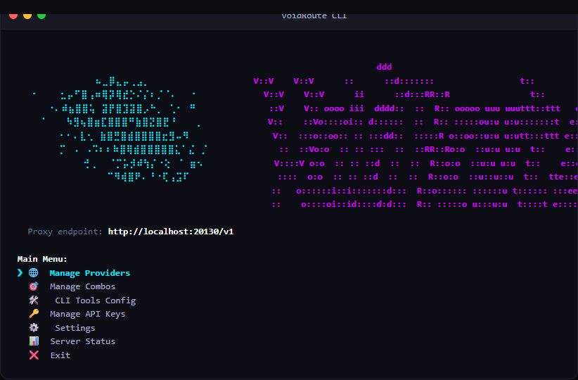

#  VoidRoute



voidRoute is a terminal-based CLI aggregator and local router for AI provider APIs. It runs the 9Router proxy backend locally and provides an interactive terminal user interface (TUI).

---

## 🎨 Inspiration
This project uses the database schema, token rotation, and SSE proxy backend from the open-source **[9Router](https://github.com/decolua/9router)** server. It wraps these services in a command-line interface.

---

## 🚀 Features

* **Side-by-Side ASCII Art**: Shows the galaxy and logo graphics scaled to fit standard terminal windows on startup.
* **Dynamic Model Listing**: Queries `/v1/models` from active providers (OpenAI, Gemini, DeepSeek, OpenRouter, Mistral, Ollama) on selection. Falls back to a local registry if the provider is offline.
* **Documentation References**: Displays clickable links to official model docs during configuration.
* **Fallback Combos**: Create ordered fallback lists (combos) manually or generate them automatically from active providers.
* **Automated Tool Configuration**: Generates and deletes configuration files for:
  * **Claude Code** (`~/.claude/settings.json`)
  * **Cline** (`~/.cline/data/globalState.json` & `secrets.json`)
  * **OpenCode** (`~/.config/opencode/opencode.json`)
  * **Aider** (`~/.aider.conf.yml`)
  * **Pi Agent** (`~/.pi/agent/models.json` & `settings.json`)
  * **Codex** (`~/.codex/config.toml` & `auth.json`)
* **Mouse Input Prevention**: Disables terminal mouse tracking to prevent clicks and hovers from disrupting menu list navigation.

---

## 🛠️ Setup

1. **Prerequisites**: Install [Bun](https://bun.sh/).
   ```bash
   bun --version
   ```
2. **Installation**: Clone the repository and install dependencies.
   ```bash
   bun install
   ```
3. **Usage**: Start the CLI app.
   ```bash
   bun index.js
   ```

On Windows, double-click **`voidRoute.bat`** to start immediately.

---

## ⚙️ Operation
voidRoute runs a local server on port `20130`.

* **Proxy endpoint**: `http://localhost:20130/v1`

Redirect your developer tools to this endpoint. The server routes requests to your configured providers, rotates credentials, and handles rate-limiting fallbacks.
